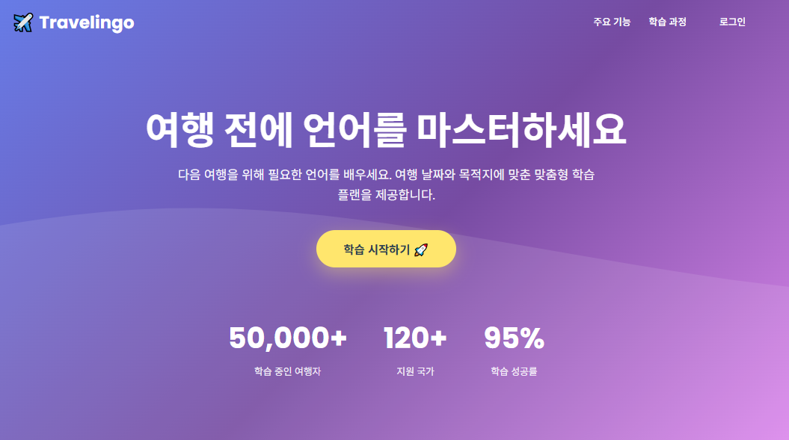

Travellingo (프로젝트 이름)
📌 프로젝트 소개

사용자의 언어 학습을 돕기 위한 서비스로,
여행 상황 기반 표현 학습 및 AI 대화를 제공하는 프로젝트입니다.

👨‍💻 담당 역할 (⭐ 제일 중요)
백엔드 API 개발 (Controller, DTO, Entity)
사용자 학습 데이터 저장 및 처리 로직 구현
Trip CRUD 기능 일부 개발
프론트엔드 ↔ 백엔드 데이터 통신 처리
프론트엔드에 필요한 버튼 기능 추가 및 UI 개선 (햄버거 메뉴 구현 포함)
프론트엔드 오류 수정 및 사용자 인터랙션 개선
백엔드 연동 과정에서 발생한 데이터 처리 및 통신 오류 해결

🛠 기술 스택
Backend: Java, Spring Boot
Database: MySQL, FastAPI
Frontend: HTML, CSS, JavaScript
Tools: Git, GitHub, Slack

📌 주요 기능
사용자 언어 및 목적지 설정 기능
여행 상황 기반 단어/표현 학습
AI 기반 대화 학습 기능
학습 데이터 저장 및 관리

📂 프로젝트 구조
controller : API 요청 처리
service : 비즈니스 로직 처리
repository : DB 접근
entity : 데이터 구조 정의

⚠️ 프로젝트 설명
※ 본 프로젝트는 팀 프로젝트이며, 저는 프론트엔드 개발을 주로 담당하고 일부 백엔드 기능 구현에도 참여했습니다.

💡 느낀 점
프론트엔드 개발을 중심으로 사용자 경험을 고려한 UI 구현 역량을 키울 수 있었습니다.
백엔드 일부 기능을 직접 구현하며 데이터 흐름과 API 구조에 대한 이해도를 높일 수 있었습니다.
프론트엔드와 백엔드 간의 연동 과정에서 협업과 설계의 중요성을 경험했습니다.

## 📸 주요 화면

